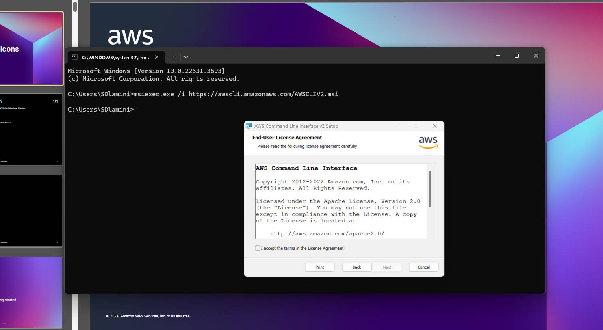
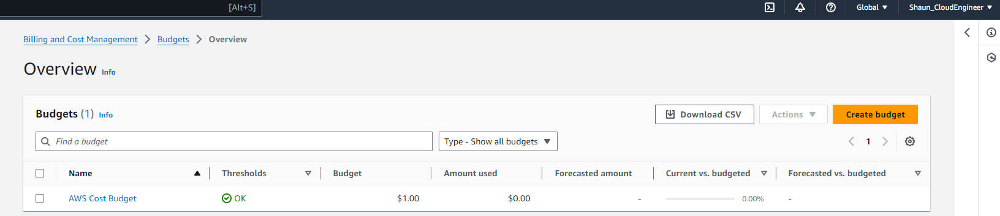

# Week 0 — Billing and Architecture

## Required Assessment / Task

### Install AWS CLI

I was not able to use Gitpod or Github Codespaces due to browser issues.
So I decided to use a local environment.

To prove that I can use the AWS CLI.

I am providing the instructions I used for the configuration of my local machine on Windows.

I did the following steps to install AWS CLI.

I installed the AWS CLI via command in ***command prompt*** :

I followed the instructions on the [AWS CLI Install Documentation Page](https://docs.aws.amazon.com/cli/latest/userguide/getting-started-install.html)



```
msiexec.exe /i https://awscli.amazonaws.com/AWSCLIV2.msi
```

I attempted to run the command by typing in 'aws' but i received an error :

```
C:\Users\SDlamini>aws
'aws' is not recognized as an internal or external command,
operable program or batch file.
```

I was able to resolve the issue by closing and opening ***CMD***


### Create a Billing Alarm

I ceated my create my own Budget for $1 because I cannot afford any kind of spend.
I did not create a seconfd Budget because I was concerned of budget spending going over the 2 budget free limit.




### Homework Changes

## Building Logical Architetural Diagram

I designed a logical architecture diagram for a app, using AWS services.


[Lucid Charts Shared Link](https://lucid.app/lucidchart/4b92fee0-8166-4d66-83e6-fe4ed69d2c73/view?page=0_0#)


